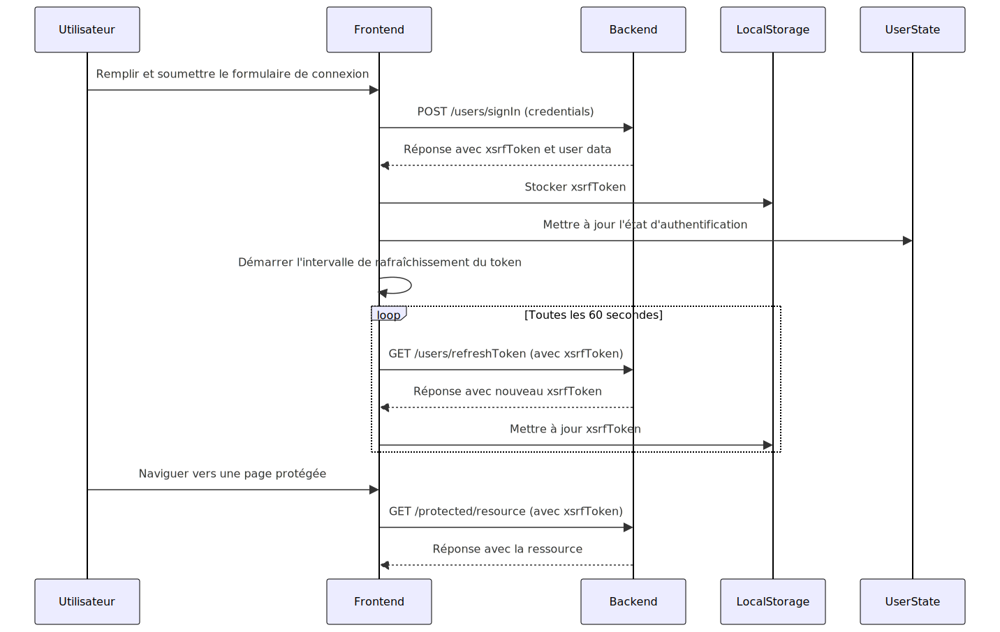

# Fluxx Frontend

Ce projet est une application web de type Single Page Application (SPA) développée avec Svelte et Vite. Il sert de base de départ pour la réalisation d’applications SPA.

## Stack technologique

### Svelte

**Svelte** est un framework JavaScript moderne qui permet de créer des interfaces utilisateur réactives. Svelte compile les composants en JavaScript optimisé au moment de la construction, ce qui permet un rendu ultra-rapide et une interaction fluide. Contrairement à d'autres frameworks, Svelte n'inclut pas de runtime ou bibliothèque volumineuse dans le bundle final, ce qui réduit la taille des fichiers JavaScript envoyés au navigateur.

### Vite

**Vite** est un bundler et serveur de développement rapide, qui offre une excellente expérience de développement. Vite révolutionne le flux de travail du développement web avec sa rapidité, sa simplicité de configuration et son support des technologies modernes. Il améliore l'expérience des développeurs grâce à des temps de démarrage instantanés, des mises à jour à chaud rapides, et une compatibilité étendue avec différents frameworks front-end, faisant de lui un choix idéal pour les projets web modernes.

### Intégration de la Stack

L'intégration de Svelte et Vite offre une solution puissante et efficace pour le développement d'applications web modernes. Svelte, avec sa syntaxe concise et ses performances optimisées, combiné à Vite, avec son démarrage instantané et son Hot Module Replacement ultra-rapide, permet de créer des applications réactives et performantes avec une expérience développeur exceptionnelle. Cette combinaison réduit les temps de build et simplifie la configuration, tout en offrant une flexibilité maximale grâce à la compatibilité avec les fonctionnalités modernes et divers frameworks front-end. Ensemble, Svelte et Vite forment une stack de développement idéale pour des projets rapides, maintenables et à hautes performances.

## Structure du projet

``` bash
frontend/
├── public/                  # Contient les ressources publiques telles que les images, les manifestes, etc.
├── src/                     # Contient le code source de l'application
│   ├── components/          # Composants réutilisables de Svelte
│   ├── lib/                 # Modules d'aide et stores Svelte
│   ├── routes/              # Composants de routage pour différentes pages
│   ├── style/               # Fichiers de style SCSS
│   ├── App.svelte           # Composant principal de l'application
│   ├── config.example.js    # Exemple de configuration de l'application
│   └── main.js              # Point d'entrée de l'application
├── .nvmrc                   # Version de Node.js à utiliser
├── eslint.config.mjs        # Configuration d'ESLint
├── jsconfig.json            # Configuration de JavaScript pour le projet
├── package.json             # Dépendances et scripts du projet
├── svelte.config.js         # Configuration de Svelte
├── vite.config.js           # Configuration de Vite
├── remoteDeploy.example.sh  # Exemple de script pour déployer en production
└── README.md                # Documentation du projet
```

## Diagramme séquentiel du flux d’authentification de l’utilisateur



## Installation

Pour installer et exécuter le projet en local, suivez les étapes suivantes :

1. **Cloner le dépôt**

```bash
git clone git@deployment:jeremydierx/fluxx-frontend.git
cd fluxx-frontend
```

2. **Installer les dépendances**

```bash
npm install
```

3. ** Adapter les fichiers de configuration à vos besoins**

```bash
cp vite.config.example.js vite.config.js
cp src/config.example.js src/config.js
cp remoteDeploy.example.sh remoteDeploy.sh
```

## En local

### Démarrer le serveur de développement

```bash
npm run dev
```

L'application sera accessible à l'adresse `https://localhost:[port]` où `[port]` est le port configuré dans le fichier `vite.config.js`.

### Génération de la documentation intégrée (JSDoc)

``` bash
$ npm run docs
```

### Linting

``` bash
$ npm run lint
```

## En distant (serveur de production)

### Commandes de Déploiement pour l'Environnement de Production

``` bash
$ npm run remoteDeployProd
```

### Commandes de Maintenance pour l'Environnement de Production

``` bash
$ npm run remoteMaintenanceOnProd # Activer le mode maintenance
$ npm run remoteMaintenanceOffProd # Désactiver le mode maintenance
```

## Pourquoi je n’utilise pas de framework «tout-en-un» ?

### Apprentissage en Profondeur:

- **Masquage de la Complexité** : Les frameworks tout-en-un ont tendance à abstraire beaucoup de complexités, ce qui peut empêcher les développeurs d'apprendre et de comprendre les mécanismes sous-jacents. Cette abstraction peut limiter la capacité des développeurs à résoudre des problèmes complexes ou à optimiser les performances de manière efficace.
- **Dépendance au Framework** : Une dépendance excessive à un framework spécifique peut restreindre la flexibilité des développeurs et les rendre moins adaptables à d'autres technologies ou paradigmes.

### Surcharge Fonctionnelle:

- **Overkill pour les Projets Simples** : Ces frameworks viennent souvent avec une multitude de fonctionnalités intégrées qui peuvent être superflues pour de nombreux projets, rendant la configuration initiale et la maintenance plus lourdes et complexes.
- **Performance Impactée** : L'inclusion de fonctionnalités non nécessaires peut alourdir l'application et impacter ses performances, surtout si ces fonctionnalités ne sont pas utilisées mais continuent de consommer des ressources.

### Flexibilité Limitée:

- **Personnalisation Difficile** : La personnalisation ou l'extension des fonctionnalités d'un framework tout-en-un peut être difficile ou impossible sans recourir à des hacks ou des contournements, ce qui peut nuire à la maintenabilité du code.
- **Contraintes architecturales** : Ces frameworks imposent souvent une architecture et une structure spécifiques, limitant la capacité des développeurs à adapter l'application à des besoins uniques ou à adopter des meilleures pratiques qui sortent du cadre défini par le framework.

